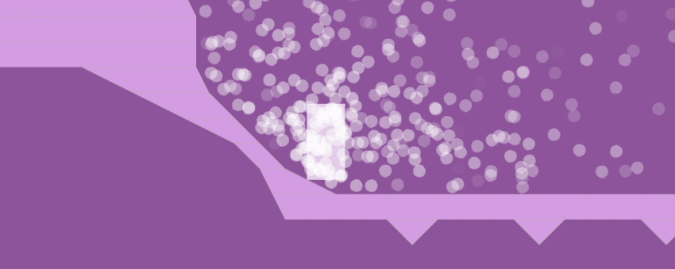

# Phaser Arcade Slopes Plugin

**Arcade Slopes** brings sloped tile collision handling to
[Phaser](http://phaser.io)'s [Arcade
Physics](http://phaser.io/examples/v2/category/arcade-physics) engine.

## [Demo](http://hexus.github.io/phaser-arcade-slopes)

Check out the **[demo](http://hexus.github.io/phaser-arcade-slopes)**!



## Features

- 24 new tile types :tada:
- SAT-driven collision handling :ok_hand:
- Unobtrusive and cooperative integration with Arcade Physics :v:
- Heuristic SAT restraints that prevent AABBs catching on hidden edges :clap:
- Supports sprites :rocket:, groups :busts_in_silhouette:, particle
  emitters :sparkles: and circular physics bodies :white_circle:

## Compatibility

| Phaser Version  | Arcade Slopes Version                                               |
|-----------------|---------------------------------------------------------------------|
| v2.4.1 - v2.4.8 | [v0.1.0](https://github.com/hexus/phaser-arcade-slopes/tree/v0.1.0) |
| v2.5.0 - v2.7.3 | [v0.1.1](https://github.com/hexus/phaser-arcade-slopes/tree/v0.1.1) - [v0.2.0-beta](https://github.com/hexus/phaser-arcade-slopes/tree/v0.2.0-beta) |

## Installation

Grab a copy of the
[latest release](https://raw.githubusercontent.com/hexus/phaser-arcade-slopes/v0.1.1/dist/phaser-arcade-slopes.min.js)
from the [**dist**](dist) directory in this repository and include it after
Phaser.

```html
<script src="phaser.min.js"></script>
<script src="phaser-arcade-slopes.min.js"></script>
```

## Usage

- [Enabling the plugin](#enabling-the-plugin)
- [Mapping tiles](#mapping-tiles)
- [Enabling physics bodies](#enabling-physics-bodies)
- [Collision](#collision)
- [Debug rendering](#debug-rendering)
- [Extras](#extras)
  - [Heuristics](#heuristics)
  - [Minimum Y Offset](#minimum-y-offset)
  - [Collision pulling](#collision-pulling)

### Enabling the plugin

Enable the plugin in the `create()` method of your Phaser state.

```js
game.plugins.add(Phaser.Plugin.ArcadeSlopes);
```

### Mapping tiles

The plugin provides a couple of built in tile slope mappings:

- [Arcade Slopes tileset](assets)
  (`arcadeslopes`)
  ([16px](https://raw.githubusercontent.com/hexus/phaser-arcade-slopes/master/assets/arcade-slopes-16.png),
  [32px](https://raw.githubusercontent.com/hexus/phaser-arcade-slopes/master/assets/arcade-slopes-32.png),
  [64px](https://raw.githubusercontent.com/hexus/phaser-arcade-slopes/master/assets/arcade-slopes-64.png),
  [128px](https://raw.githubusercontent.com/hexus/phaser-arcade-slopes/master/assets/arcade-slopes-128.png))
- [Ninja Physics debug tileset](https://github.com/photonstorm/phaser/tree/v2.4.7/resources/Ninja%20Physics%20Debug%20Tiles)
  (`ninja`)
  ([32px](https://raw.githubusercontent.com/photonstorm/phaser/v2.4.7/resources/Ninja%20Physics%20Debug%20Tiles/32px/ninja-tiles32.png), [64px](https://raw.githubusercontent.com/photonstorm/phaser/v2.4.7/resources/Ninja%20Physics%20Debug%20Tiles/64px/ninja-tiles64.png),
  [128px](https://raw.githubusercontent.com/photonstorm/phaser/v2.4.7/resources/Ninja%20Physics%20Debug%20Tiles/128px/ninja-tiles128.png))

After you've created a tilemap with a collision layer, you'll need to convert
that layer to work with Arcade Slopes.

```js
map = game.add.tilemap('tilemap');
map.addTilesetImage('collision', 'arcade-slopes-32');

ground = map.createLayer('collision');

// Convert the collision layer to work with Arcade Slopes
game.slopes.convertTilemapLayer(ground, 'arcadeslopes');
```

In the case that the first tile ID of the collision tileset in your tilemap is
not `1` (the default), you can provide a third argument to specify it.

```js
game.slopes.convertTilemapLayer(ground, 'ninja', 16);
```

### Enabling physics bodies

Now you need to enable slopes for any game entities you want to collide against
the tilemap.

```js
game.physics.arcade.enable(player);

game.slopes.enable(player);
game.slopes.enable(emitter);
```

You don't need to do anything special for circular physics bodies, just the
usual `sprite.body.setCircle(radius)`.

_Make sure you call `game.slopes.enable(object)` **after** making any changes to
the **size** or **shape** of the physics body._

### Collision

Now you can collide your sprite against the tilemap in the `update()` method of
your Phaser state, as you normally would, using Arcade Physics. Voila!

```js
// Collide the player with the collision layer
game.physics.arcade.collide(player, ground);

// Collide the particles with the collision layer
game.physics.arcade.collide(emitter, ground);
```

### Debug rendering

To debug your collision layer, set its debug property to `true`.

This will overlay the collision shapes of each tile when the layer is rendered.

```js
ground.debug = true;
```

### Extras

#### Heuristics

The plugin uses heuristics to prevent physics bodies from catching on
undesirable tile edges; the touching edges of two adjacent tiles.

**This is enabled by default.** If you don't need this feature, you can disable
it.

```js
game.slopes.heuristics = false;
```

#### Minimum Y offset

This feature separates rectangular physics bodies on the Y axis only, in the
right situations.

```js
// Prefer the minimum Y offset for this physics body
player.body.slopes.preferY = true;

// Prefer the minimum Y offset globally
game.slopes.preferY = true;
```

If you're making a platformer, your player has drag on the X axis, and you don't
want it to slide down slopes, this should solve your problem.

#### Collision pulling

To attempt to keep objects on a surface, you can use collision pulling.

This will pull physics bodies into a collision by a set velocity, if it matches
the set direction.

```js
// Pull the player into downwards collisions with a velocity of 50
player.body.slopes.pullDown = 50;
```

Here are the available properties for collision pulling:

```js
body.slopes.pullUp
body.slopes.pullDown
body.slopes.pullLeft
body.slopes.pullRight
body.slopes.pullTopLeft
body.slopes.pullTopRight
body.slopes.pullBottomLeft
body.slopes.pullBottomRight
```

## Building

If you want to build the plugin yourself from source, install Bower, clone the
repository and run NPM, Bower and Gulp like so.

```bash
npm i -g bower
npm install
bower install
gulp build
```

There's also a watch task that builds the plugin whenever you make changes
to the source.

```bash
gulp watch
```

## Thanks

My thanks go out to those who made this Plugin possible.

- [Richard Davey](https://twitter.com/photonstorm) - for Phaser :rocket:
- [Jim Riecken](https://github.com/jriecken) - [SAT.js](https://github.com/jriecken/sat-js)
  is awesome and saved me loads of time
- [Metanet](http://www.metanetsoftware.com/) - for their incredibly helpful
  tutorials about [collision](http://www.metanetsoftware.com/technique/tutorialA.html)
  [detection](http://www.metanetsoftware.com/technique/tutorialB.html)
- [Olivier Renault](http://elancev.name/oliver/2D%20polygon.htm#tut4) - for their
  tutorial on 2D polygon collision and response (from 2004!)
- [Jan Geselle](https://github.com/geselle-jan) - for writing [a sloped tile
  implementation](https://github.com/geselle-jan/Metroid/commit/9c213e9f5779df1dcd6f7d2bed2a9b676a9e3c6b#diff-467b4e6069f6692511fc5e60f3c426ccR158)
  in Phaser that gave me the idea to write this plugin
- Bethany - for listening to me blabber on about slopes for well over a month
  :full_moon_with_face:

And to contributors who have been generous with their time, talents and support:

- [@IkonOne](https://github.com/IkonOne)
- [@michaeljcalkins](https://github.com/michaeljcalkins)
- [@kevinchau321](https://github.com/kevinchau321)
